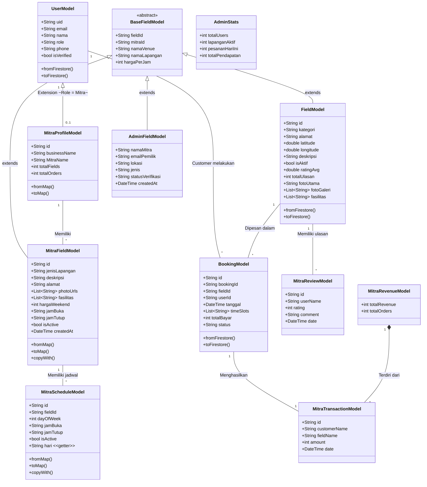

# Class Diagram Sistem Lapangku (Refactored)

Berikut adalah Class Diagram untuk sistem aplikasi Lapangku setelah dilakukan refactoring dengan prinsip OOP (Inheritance) dan standardisasi penamaan:

---

## 📖 Penjelasan Class dan Model

Sistem ini menerapkan prinsip **OOP Inheritance** dan **standardisasi penamaan** untuk integrasi Firestore yang lebih bersih. Semua model lapangan kini mewarisi dari satu class abstrak `BaseFieldModel`.

### 1. Abstract Class: BaseFieldModel (BARU)
*   **`BaseFieldModel`**: Class abstrak yang menjadi parent dari semua model lapangan. Mendefinisikan 5 properti universal: `fieldId`, `mitraId`, `namaVenue`, `namaLapangan`, dan `hargaPerJam`.
*   Semua variasi penamaan ID pemilik (`idPemilik`, `MitraId`, `mitraUid`) kini distandarkan menjadi **`mitraId`** — konsisten dengan penamaan role di Firebase.
*   Semua variasi penamaan ID lapangan (`idLapangan`) kini distandarkan menjadi **`fieldId`**.

### 2. Model Pengguna (User & Profile)
*   **`UserModel`**: Entitas utama untuk semua pengguna (Customer, Mitra, Admin). Menyimpan `uid`, `email`, `nama`, dan `role`.
*   **`MitraProfileModel`**: Ekstensi profil khusus untuk `role = mitra`. Menyimpan detail bisnis, dokumen verifikasi, dan informasi bank.

### 3. Model Lapangan (Inheritance dari BaseFieldModel)
Ketiga model berikut kini melakukan **`extends BaseFieldModel`**, sehingga properti bersama tidak duplikat:
*   **`FieldModel`** → Tampilan **Customer**. Memuat rating, foto, lokasi, dan deskripsi.
*   **`MitraFieldModel`** → Dashboard **Mitra**. Memuat pengaturan harga, jadwal, dan status aktif.
*   **`AdminFieldModel`** → Dashboard **Admin**. Berisi ringkasan dan status verifikasi.

### 4. Model Transaksi (Booking & Pendapatan)
*   **`BookingModel`**: Inti transaksi yang menghubungkan Customer dan Lapangan.
*   **`MitraTransactionModel`**: Riwayat transaksi untuk dashboard Mitra.
*   **`MitraRevenueModel`**: Agregasi dari kumpulan transaksi Mitra.

### 5. Model Pendukung Lapangan
*   **`MitraScheduleModel`** (REFACTORED): Properti `hari` (String) diganti menjadi `dayOfWeek` (int: 1=Senin..7=Minggu). Tersedia getter `.hari` untuk backward-compat.
*   **`MitraReviewModel`**: Ulasan/rating dari Customer untuk suatu lapangan.

### 6. Model Admin
*   **`AdminStats`**: Statistik global sistem (total user, lapangan aktif, pesanan hari ini, pendapatan).

---

## 🔗 Penjelasan Relasi antar Class

1.  **`BaseFieldModel` ← `FieldModel`, `MitraFieldModel`, `AdminFieldModel`** (Inheritance):
    Ketiga model lapangan mewarisi properti bersama (`fieldId`, `mitraId`, `namaVenue`, `namaLapangan`, `hargaPerJam`) dari satu class abstrak.
2.  **`UserModel` (Customer) ↔ `BookingModel`** (One-to-Many):
    Satu customer dapat membuat banyak booking.
3.  **`UserModel` ↔ `MitraProfileModel`** (One-to-One):
    Jika `role = mitra`, maka memiliki satu `MitraProfileModel`.
4.  **`MitraProfileModel` ↔ `MitraFieldModel`** (One-to-Many):
    Satu mitra memiliki banyak lapangan.
5.  **`FieldModel` ↔ `BookingModel`** (One-to-Many):
    Satu lapangan dapat dipesan berkali-kali.
6.  **`MitraFieldModel` ↔ `MitraScheduleModel`** (One-to-Many):
    Satu lapangan memiliki banyak jadwal (per hari).
7.  **`FieldModel` ↔ `MitraReviewModel`** (One-to-Many):
    Satu lapangan memiliki banyak ulasan.
8.  **`BookingModel` ↔ `MitraTransactionModel`** (One-to-One):
    Satu booking menghasilkan satu transaksi pendapatan.
9.  **`MitraRevenueModel` ↔ `MitraTransactionModel`** (Composition):
    Laporan pendapatan terdiri atas kumpulan transaksi individual.

---

## 🔄 Ringkasan Perubahan Refactoring

| Aspek | Sebelum | Sesudah |
|---|---|---|
| **Inheritance** | Tidak ada parent class | `BaseFieldModel` (abstract) → 3 child classes |
| **ID Pemilik** | `idPemilik`, `MitraId`, `mitraUid` (inkonsisten) | `mitraId` (standar, konsisten dgn role Firebase) |
| **ID Lapangan** | `idLapangan` | `fieldId` (standar) + backward-compat getter |
| **Jadwal Hari** | `hari` (String: "Senin") | `dayOfWeek` (int: 1=Senin) + getter `.hari` |
| **Backward Compat** | - | Semua `fromMap`/`fromFirestore` membaca key lama dengan fallback `??` |
